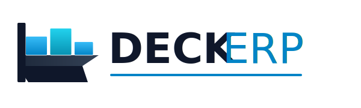

<div align="center">
  <a href="https://github.com/deryakmrt/ErpSystem">
    
  </a>

  <h2>⚓ DECK ERP</h2>
  <p>
    <b>Modern, Cloud-Native Enterprise Resource Planning System</b>
  </p>
  
  <p>
    
    
    
  </p>
  
  <br>
</div>

## Özellikler

- ✅ Clean Architecture
- ✅ CQRS Pattern
- ✅ RESTful API
- ✅ PostgreSQL veritabanı
- ✅ Docker containerization
- ✅ Swagger/OpenAPI
- ✅ Unit & Integration Tests

## Teknoloji Stack

- **Backend:** ASP.NET Core 8
- **Database:** PostgreSQL 16
- **ORM:** Entity Framework Core
- **Authentication:** JWT
- **Containerization:** Docker
- **Orchestration:** Kubernetes (yakında)

## Kurulum

### Gereksinimler
- .NET 8 SDK
- Docker Desktop
- Git

### Çalıştırma

1. Repository'yi klonla:
```bash
git clone https://github.com/username/erp-system.git
cd erp-system
```

2. Docker servisleri başlat:
```bash
docker-compose up -d
```

3. Veritabanı migration:
```bash
dotnet ef database update --project src/ErpSystem.Infrastructure
```

4. API'yi çalıştır:
```bash
dotnet run --project src/ErpSystem.Api
```

API: http://localhost:5000
Swagger: http://localhost:5000/swagger

## Mimari
```
ErpSystem/
├── API Layer         → Controllers, Middleware
├── Application       → Business Logic, Services
├── Domain            → Entities, Interfaces
└── Infrastructure    → Database, External APIs
```

## Roadmap

- [x] Proje yapısı
- [x] Database setup
- [ ] Order Management modülü
- [ ] Product Catalog
- [ ] Customer Management
- [ ] Authentication & Authorization
- [ ] Kubernetes deployment
- [ ] CI/CD Pipeline

---


